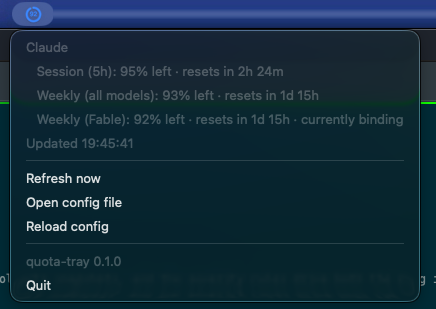

# quota-tray

A small gauge in the macOS menu bar / Windows system tray showing how much of your AI quota is **left**.

The icon is a ring: the filled arc is the headroom remaining, the number in the middle is the percent
left, and the colour (blue / amber / red / grey) is how worried you should be. Click it for a breakdown
per provider and per window (5-hour session, weekly, per-model weekly, month-to-date spend), when each
resets, and the usual Refresh / Open config / Quit.

<p align="center"></p>

Out of the box it reads your **Claude Pro/Max** limits using the login Claude Code already has
on the machine — no setup. **GitHub Copilot** premium requests work the same way off your `gh` login
(beta). Add an Admin API key and it will also track **Claude Developer Platform** spend against a
monthly budget. Other APIs plug in as providers (see below).

## Install

Download from [Releases](https://github.com/barracoder/quota-tray/releases). Each release has an installer and a portable zip per platform.

| Platform | Installer | What it does |
| --- | --- | --- |
| macOS (Apple Silicon / Intel) | `quota-tray-osx-arm64.dmg` / `quota-tray-osx-x64.dmg` | Open, drag `QuotaTray` to the Applications shortcut. The app is ad-hoc signed, so the first launch is right-click → **Open** (or *System Settings → Privacy & Security → Open Anyway* on macOS 15+). To start at login, add it under *System Settings → General → Login Items*. |
| Windows (x64 / ARM64) | `quota-tray-win-x64-setup.exe` / `quota-tray-win-arm64-setup.exe` | Per-user install into `%LOCALAPPDATA%\Programs\QuotaTray`, no admin rights. Adds a Start Menu entry and an uninstaller; tick **Start QuotaTray when I sign in** during setup if you want it on login. The installer is unsigned, so SmartScreen will ask once: *More info → Run anyway*. |
| Portable | `quota-tray-<rid>.zip` | Unzip and run. macOS zips contain the `.app`; Windows zips contain `QuotaTray.exe` and its native libraries. |

Nothing is written outside your user profile.

## Configuration

The config file is created on first run:

| OS | Path |
| --- | --- |
| macOS | `~/Library/Application Support/quota-tray/config.json` |
| Windows | `%APPDATA%\quota-tray\config.json` |
| Linux | `~/.config/quota-tray/config.json` |

Override the location with the `QUOTA_TRAY_CONFIG` environment variable. Comments and trailing commas are allowed.
**Open config file** in the menu opens it; **Reload config** applies changes without restarting.

```jsonc
{
  "pollIntervalSeconds": 60,          // minimum 10
  "warnAtRemainingPercent": 25,       // ring turns amber at or below this
  "criticalAtRemainingPercent": 10,   // ring turns red at or below this
  "providers": [
    {
      "type": "claude-subscription",
      "name": "Claude Max"
      // no key needed: uses Claude Code's login (Keychain on macOS, ~/.claude/.credentials.json elsewhere)
    },
    {
      "type": "github-copilot",            // beta
      "name": "Copilot"
      // no key needed if `gh auth login` has been run; otherwise GITHUB_TOKEN / apiKeyEnv / apiKey
    },
    {
      "type": "anthropic-cost",
      "name": "Console",
      "apiKeyEnv": "ANTHROPIC_ADMIN_KEY",   // name of an env var holding the key …
      // "apiKey": "sk-ant-admin01-…",     // … or the key itself (not recommended)
      "monthlyBudgetUsd": 200
    }
  ]
}
```

### Provider fields common to every type

| Field | Meaning |
| --- | --- |
| `type` | Which provider. Unknown types show up as an error in the menu rather than being ignored. |
| `name` | Label in the menu. Defaults to `type`. |
| `enabled` | Default `true`. |
| `apiKey` | The secret itself. Wins over everything else. |
| `apiKeyEnv` | Name of an environment variable holding the secret. If you set this and the variable is empty, the provider errors rather than silently falling back. |
| *(neither)* | The provider's default variable is consulted (table below). |

The icon shows the single most-constrained window across all providers. The tooltip and menu show everything.

## Providers

| `type` | What it measures | Credential | Default env var |
| --- | --- | --- | --- |
| `claude-subscription` | Claude Pro/Max/Team plan limits: 5-hour session, weekly (all models), weekly per model, extra-usage credits if enabled | Claude Code's OAuth token, read from the macOS Keychain item `Claude Code-credentials` or `~/.claude/.credentials.json` (`CLAUDE_CONFIG_DIR` honoured). Run `claude` once and sign in. | `CLAUDE_CODE_OAUTH_TOKEN` |
| `anthropic-cost` | Claude Developer Platform (Console) spend this calendar month vs. `monthlyBudgetUsd`, via the [Usage & Cost Admin API](https://platform.claude.com/docs/en/manage-claude/usage-cost-api) | Admin API key (`sk-ant-admin…`). Workspace-scoped keys do not work. Individual (non-organisation) Console accounts have no Admin API. | `ANTHROPIC_ADMIN_KEY` |
| `github-copilot` **(beta)** | GitHub Copilot premium requests remaining this month, plus any other metered quota on your plan (unlimited ones are hidden). Shows plan name, overage count and reset date. | A GitHub token for the user: `GITHUB_TOKEN`, `GH_TOKEN`, or the token `gh auth token` prints (gh is looked up on PATH and in the usual install locations). Any scope works; it only needs to identify you. | `GITHUB_TOKEN` |

Both accept an optional `baseUrl` setting for proxies.

Providers marked **beta** get "(beta)" appended to their name in the menu. It means the upstream API is
undocumented or unstable, not that the code is untested.

### Caveats worth knowing

- **The subscription endpoint is not a documented public API.** It is the one Claude Code's `/usage` command uses.
  Anthropic can change or remove it at any time; when they do, the provider will show an error, not wrong numbers.
- **The Copilot endpoint is internal too.** It is what the Copilot editor extensions call. GitHub's official billing
  API only reports consumption, not the allowance, and needs a fine-grained token with *Plan: read*; this provider
  will move to it if that changes.
- **Token handling is read-only.** quota-tray never writes to the Keychain or credentials file and never refreshes
  the token itself (that could invalidate Claude Code's session). When the token expires, the menu tells you to run `claude`.
- **The cost provider lags.** Anthropic's cost report is updated periodically, not in real time.

## Adding a provider

Implement two small interfaces from `QuotaTray.Core` and register the factory in `AppHost`. Full walkthrough in
[docs/adding-a-provider.md](docs/adding-a-provider.md). The contract in one breath:

```csharp
public interface IUsageProviderFactory
{
    string Type { get; }                                   // config "type"
    string Description { get; }
    string? DefaultApiKeyEnvironmentVariable { get; }
    IUsageProvider Create(ProviderConfig config, ProviderContext context);
}

public interface IUsageProvider
{
    string Id { get; }
    string DisplayName { get; }
    Task<UsageSnapshot> FetchAsync(CancellationToken ct);  // throw on failure; the poller shows it
}
```

A `UsageSnapshot` is a list of `QuotaWindow(Label, UsedPercent, ResetsAt?, Detail?)`. That is the whole model;
the UI does not know or care what is behind a window.

## Development

Requires the .NET 10 SDK. Scripts exist in both bash and PowerShell and do the same thing.

```sh
scripts/build.sh            # restore, build, test
scripts/publish.sh          # self-contained build for this machine → artifacts/<rid>/ (+ .app on macOS)
scripts/publish.sh win-x64  # or any RID: win-arm64, osx-arm64, osx-x64
scripts/package.sh          # installer for this machine: .dmg (macOS, hdiutil) or -setup.exe (Windows, Inno Setup 6)
scripts/make-icons.py       # regenerate the icon assets (needs Pillow); outputs are committed
dotnet run --project src/QuotaTray.App
```

```powershell
scripts/build.ps1
scripts/publish.ps1 -Rid win-x64
scripts/package.ps1 -Rid win-x64
```

Layout:

```
src/QuotaTray.Core                 contract, config, secret resolution, polling, severity
src/QuotaTray.Providers.Anthropic  claude-subscription, anthropic-cost
src/QuotaTray.Providers.GitHub     github-copilot (beta)
src/QuotaTray.App                  Avalonia tray app: icon renderer, menu, composition root, icon assets, Info.plist
installer/windows                  Inno Setup script (per-user, no admin)
tests/                             xUnit; HTTP is faked, fixtures are real captured payloads
```

Two macOS rules learned the hard way, both documented in `TrayController`: never replace the tray icon's
`NativeMenu` instance after it is attached (Avalonia throws), and never churn native-backed objects
(menu items, icons) per refresh — they are released from the finalizer thread and AppKit crashes.
Menu items are a fixed pool updated in place; icons are cached.

CI builds, tests, publishes and packages win-x64, win-arm64, osx-arm64 and osx-x64 on every push; a `v*` tag creates a GitHub release with the installers and zips attached. Neither installer is code-signed; see [Installers](#install) for what that means for users.

## License

[MIT](LICENSE)
