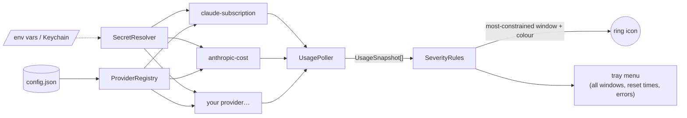

# Adding a provider

A provider turns "some API that knows how much of something you have used" into a list of
`QuotaWindow`s. Everything else — polling, error handling, the icon, the menu, secret lookup —
is shared.



## 1. Pick a project

Providers for one vendor live together: `src/QuotaTray.Providers.<Vendor>/`. Create a new class
library if the vendor is new, referencing `QuotaTray.Core`. The App project then references it.

## 2. Implement the factory

```csharp
using QuotaTray.Core;

public sealed class AcmeProviderFactory : IUsageProviderFactory
{
    public string Type => "acme";                       // what users put in "type"
    public string Description => "Acme API credits remaining this billing period.";
    public string? DefaultApiKeyEnvironmentVariable => "ACME_API_KEY";

    public IUsageProvider Create(ProviderConfig config, ProviderContext context) =>
        new AcmeProvider(config, context);
}
```

`Create` runs once at startup and after **Reload config**. Validate provider-specific settings here
and throw `InvalidOperationException` with a message a human can act on — the registry turns it
into a menu entry such as `⚠ 'monthlyBudgetUsd' is required…` instead of crashing.

## 3. Implement the provider

```csharp
public sealed class AcmeProvider(ProviderConfig config, ProviderContext context) : IUsageProvider
{
    public string Id => config.EffectiveName;           // the registry overrides these anyway
    public string DisplayName => config.EffectiveName;

    public async Task<UsageSnapshot> FetchAsync(CancellationToken ct)
    {
        var secret = context.Secrets.Resolve(config, "ACME_API_KEY")
            ?? throw new InvalidOperationException("No Acme key. Set apiKey/apiKeyEnv or export ACME_API_KEY.");

        using var request = new HttpRequestMessage(HttpMethod.Get, "https://api.acme.example/v1/credits");
        request.Headers.TryAddWithoutValidation("x-api-key", secret.Value);
        using var response = await context.HttpClient.SendAsync(request, ct);
        response.EnsureSuccessStatusCode();
        var dto = await response.Content.ReadFromJsonAsync<AcmeCredits>(ct) ?? throw new InvalidDataException("empty body");

        var usedPercent = 100d * dto.Used / dto.Limit;
        return new UsageSnapshot(Id, DisplayName, context.Clock.GetUtcNow(),
        [
            new QuotaWindow("Credits", usedPercent, dto.PeriodEnd, $"{dto.Used} of {dto.Limit}"),
        ]);
    }
}
```

Rules of the road:

- **Throw on failure.** The poller catches, times out (20 s), and shows the message. Never return a
  snapshot with made-up zeros.
- **Use `context.HttpClient`.** It carries the User-Agent and connection pool. Don't create your own.
- **Use `context.Clock`, not `DateTimeOffset.UtcNow`.** Tests inject a fixed clock.
- **Secrets go through `context.Secrets.Resolve(config, defaultEnvVar)`.** That gives users the
  `apiKey` / `apiKeyEnv` / default-env-var precedence for free, and a consistent error message.
- **Extra settings** come from `config.GetString("key")`, `GetDouble`, `GetBool`. Anything in the
  provider's JSON object that isn't a known field lands there.
- `UsedPercent` is 0–100 of the *limit*. The UI shows `100 - UsedPercent` as "left". Values over
  100 are fine (overage) and clamp to 0 % left.

## 4. Register it

In `src/QuotaTray.App/AppHost.cs`:

```csharp
var registry = new ProviderRegistry()
    .Register(new ClaudeSubscriptionProviderFactory())
    .Register(new AnthropicCostProviderFactory())
    .Register(new AcmeProviderFactory());
```

## 5. Test it

Copy the pattern in `tests/QuotaTray.Providers.Anthropic.Tests`: a `FakeHttpMessageHandler` that
replays a captured response and records the request, and a `FixedClock`. Assert on the exact URL
and headers you send (that is where provider bugs live) and on the mapped windows. Put a real,
redacted response in `Fixtures/`.

## 6. Document it

Add a row to the Providers table in `README.md`: type, what it measures, which credential, default env var.
